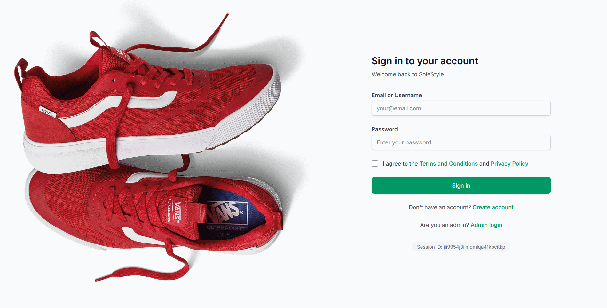
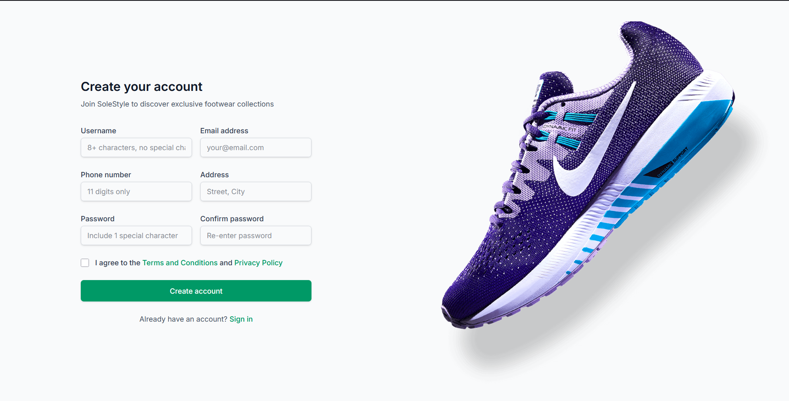
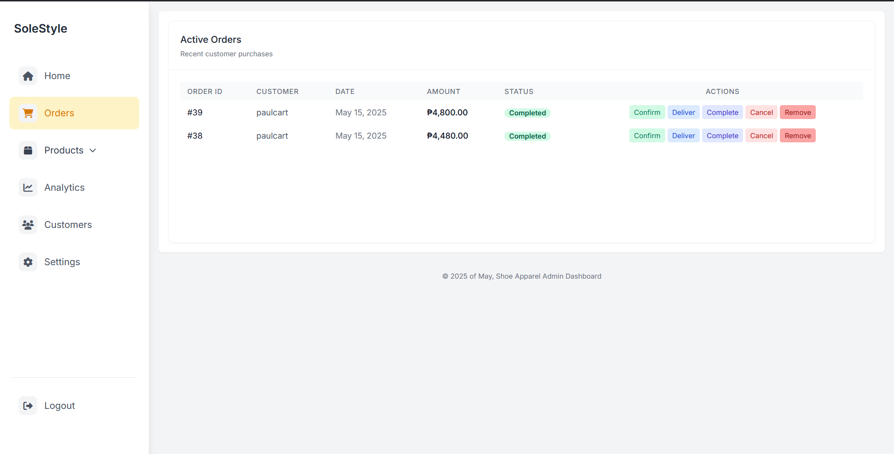
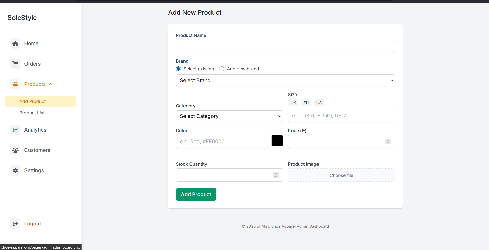
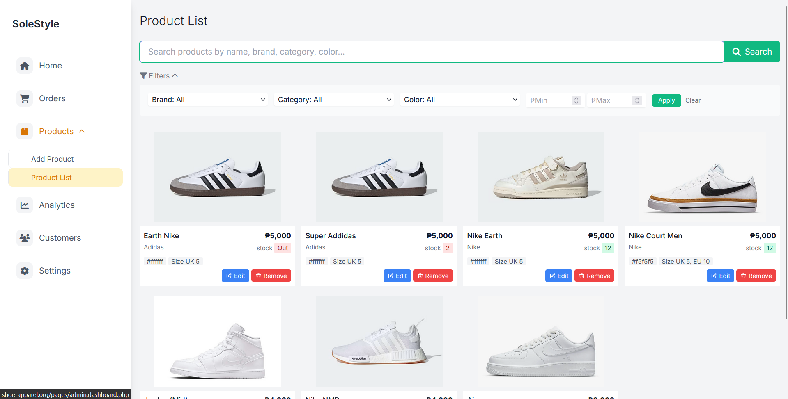
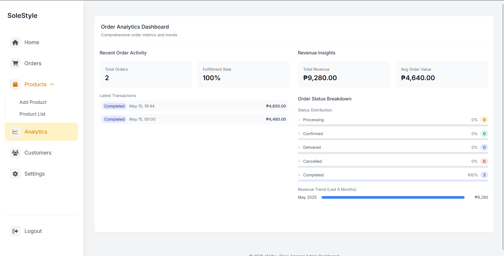
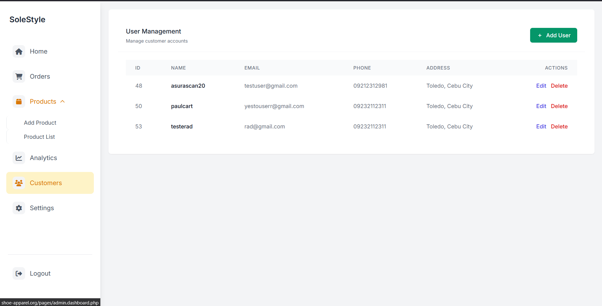
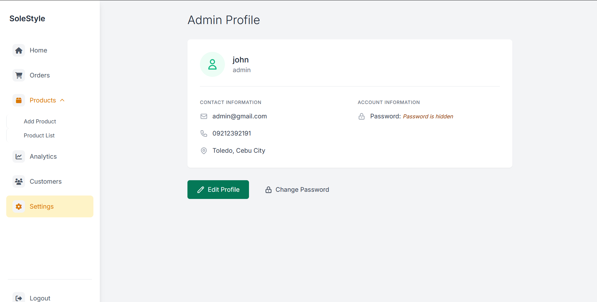

# SoleStyle

This a simple shoe ecommerce .

- **Admin Dashboard**  
  

- **Admin Order Section**  
  

- **Admin Product & Product List**  
  
  

- **Admin Analytics**  
  

- **Admin User Management**  
  

- **Admin Settings**  
  

# Contact Me For DB schema

Project Lead and Developer: johnclarencepalma7@gmail.com | LinkedIn: https://www.linkedin.com/in/rencee/

# Notice

All picture files are in the asset folder. If you want to add a product, make sure to add a new picture for that new product.
